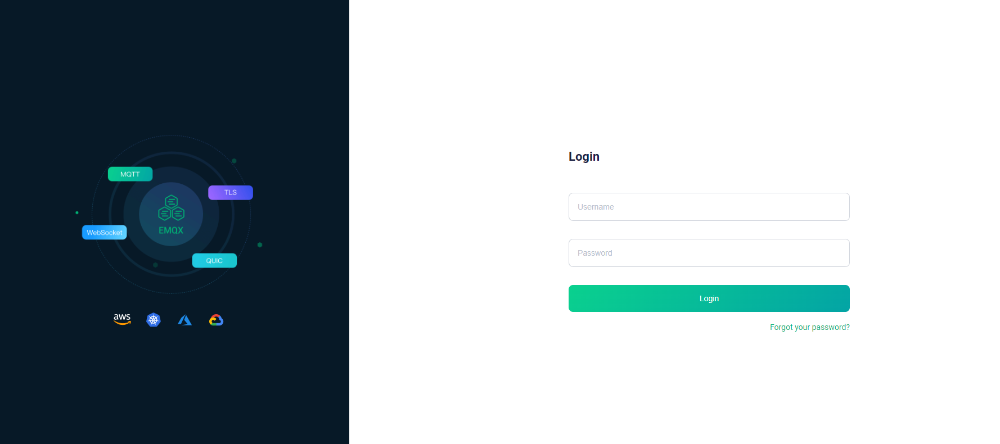

# EMQX Agent CI/CD pipeline

Deploy EMQX with CI/CD on Elestio

 
 

# When deploying ...

You can open EMQX UI here:

    URL: https://[CI_CD_DOMAIN]
    Login: admin
    password: [ADMIN_PASSWORD]

# Testing the Broker

You can conveniently test your MQTT broker using an online tool. Follow these steps:

1. Visit <a href="https://testclient-cloud.mqtt.cool/">MQTT Test Client</a>

2. Use the following credentials:

   Protocol: tcp
   Host: [CI_CD_DOMAIN]
   Port: 1883

# Adding Authentication

Securing your broker with authentication is essential for protecting your data. Follow these steps to add authentication:

1. Access the `Access Control` settings by clicking on the shield icon.
2. Click on the `Authentication` tab.
3. Press the `Create` button.
4. Choose `Password-Based` in the Mechanism section, then click `Next`.
5. Select `Built-in Database` for the Backend, then click `Next`.
6. Configure the settings by choosing `username` as the `UserID Type`, then click `Create`.
7. Once created, navigate to the `Users` button on your new `Built-in Database`.
8. Click on the `+` button to create a new user and provide the necessary credentials.

Now, you can test the authentication using the link provided in the `Testing the Broker` section, using the updated credentials.
